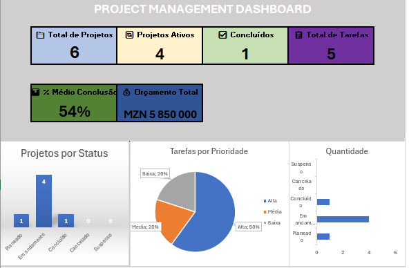

# 📊 Project Management System (PMS) — Excel Avançado & Dashboards Executivos


Um sistema completo, dinâmico e estruturado de **Acompanhamento de Projectos e Controlo Operacional**, desenvolvido integralmente em **Microsoft Excel**. 

Este sistema foi idealizado para centralizar a gestão de portfólio de projectos, controlo de tarefas, alocação de recursos humanos, orçamentos, riscos e fornecedores, oferecendo um **Dashboard Executivo** para suporte à tomada de decisão rápida e baseada em dados.

---

## 📌 Visão Geral do Dashboard Executivo



---

## 🚀 Principais Funcionalidades

### 1. 🖥️ Dashboard Executivo (KPIs e Visualização)
* **Cartões de Resumo (KPIs):**
  * **Total de Projectos** registados (6).
  * **Projectos Activos** em andamento (4).
  * **Projectos Concluídos** (1).
  * **Total de Tarefas** associadas (5).
  * **% Médio de Conclusão Global** (54%).
  * **Orçamento Total Gerido** (MZN 5.850.000).
* **Gráficos Dinâmicos:**
  * Distribuição de projectos por estado (*Planeado, Em Andamento, Concluído, Cancelado, Suspenso*).
  * Análise de tarefas por nível de prioridade (*Alta, Média, Baixa*).
  * Controlo e acompanhamento de quantidade de tarefas por estado operacional.

### 2. 📁 Módulos de Operação e Tabelas Relacionais
* **`Projetos`:** Controlo centralizado do portfólio (ID, Nome do Projecto, Cliente, Gestor, Datas de Início/Fim, % de Conclusão e Orçamento).
* **`Tarefas`:** Acompanhamento de etapas operacionais vinculadas aos projectos, responsáveis, prazos, prioridades e observações.
* **`Recursos`:** Mapeamento de capital humano (Cargo, Departamento e Taxa de Disponibilidade %).
* **`Custos & Riscos`:** Monitorização orçamental detalhada e matriz de gestão de riscos operacionais/financeiros.
* **`Fornecedores`:** Gestão de parceiros, procurement e cotações externas.
* **`Cronograma`:** Visualização temporal de prazos de entrega e marcos críticos.

### 3. ⚙️ Parâmetros e Modelo de Dados
* **`Configuracoes`:** Tabela de parametrização de estados, prioridades, departamentos, tipos de custo e riscos para validação de dados (*dropdowns*).
* **`Base_Dados`:** Área de consolidação para apoio às fórmulas do Dashboard.

---

## 🛠️ Tecnologias e Recursos Aplicados no Excel

* **Tabelas Estruturadas (`Ctrl + T`):** Referências dinâmicas para facilidade de expansão de dados.
* **Validação de Dados:** Listas suspensas dinâmicas para padronização de registos.
* **Formatação Condicional:**
  * Barras de progresso integradas nas células para visualização da `% Conclusão`.
  * Destaque automático de cores por estado operacional.
* **Fórmulas Avançadas:** `CONT.SE`, `SOMASE`, `PROCX` / `PROCV`, `MÉDIA` e cálculos de percentagens condicionais.
* **Dashboards & Visualização de Dados:** Layout corporativo com métricas limpas e focadas em decisão.

---

## 📂 Estrutura do Repositório

```text
.
├── Project_Management_System.xlsx   # Ficheiro principal em Excel
├── docs/                            # Imagens do projecto
│   └── dashboard.png                # Captura de ecrã do Dashboard
└── README.md                        # Documentação do projecto